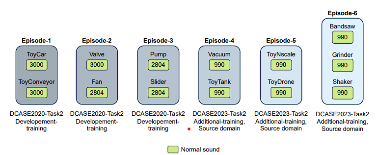
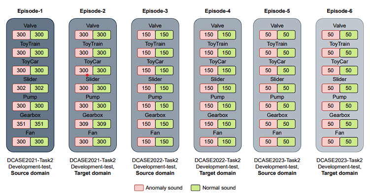

# Advanced Continual Learning Frameworks for Multimodal Vision and Audio

This repository contains the research and implementation for my **M.Tech thesis**, which explores **continual learning (CL)** strategies to mitigate catastrophic forgetting in dynamic, real-world environments. The work is divided into two primary applications:

1. **Multimodal Continual Learning for Agricultural Leaf Counting (MCLC-Net)**
2. **Continual Learning for Sound Anomaly Detection**

---

## 📌 Part 1: Multimodal Continual Learning for Leaf Counting (MCLC-Net)

### Motivation
Agricultural environments are dynamic: crop types, growth stages, and conditions evolve over time. Traditional models fail to adapt without catastrophic forgetting. To address this, we introduce **MCLC-Net**, a novel continual learning framework designed for **multimodal leaf counting**.

### 🔑 Key Features
- **Multimodal Fusion**  
  Integrates **RGB, depth, and thermal** inputs for richer representations.
- **Experience Replay**  
  Distance-based replay mechanism selects and retains the most representative samples from past tasks.
- **Robustness to Missing Modalities**  
  Stochastic modality dropout during training enables reliability when sensors fail or modalities are unavailable.

### 📊 Results
- Outperforms standard CL baselines (**EWC, SI, GEM**) on the custom **MMLC dataset**.  
- Demonstrates **high robustness** under missing modality scenarios.

---

## 📌 Part 2: Continual Learning for Sound Anomaly Detection

### Motivation
Industrial environments are dynamic: machine sounds shift due to **wear, load, and background noise**. Models must **adapt continually** without forgetting previously learned sounds.

### 🔑 Key Contributions
- **Novel Benchmark Curation**  
  Sequential dataset curated from **DCASE 2020–2023** challenges. Two scenarios:  
  - *Class-Incremental (CI):* Learn new machine types over time.  
  - *Domain-Incremental (DI):* Learn anomalies under changing environments.  

- **Benchmarking CL Strategies**  
  Evaluated 7+ CL algorithms (**EWC, SI, GEM, Replay-based methods**) for audio.

- **Improved State-of-the-Art with ViT**  
  Enhanced **Co2L** framework by replacing CNN backbone with a **Vision Transformer (ViT)**, leveraging its ability to capture global dependencies in spectrograms.
  

### 📊 Results
- **Co2L (ViT)** achieves:  
  - ~**4% higher accuracy (78.30%)** in DI setting vs. ResNet-based Co2L.  
  - **Lowest negative BWT**, showing strong resistance to forgetting.

---

## 🛠️ Tech Stack
- **Frameworks:** PyTorch, Torchvision  
- **Models:** CNN, Vision Transformer (ViT)  
- **Datasets:** Custom **MMLC dataset**, DCASE 2020–2023  

---

